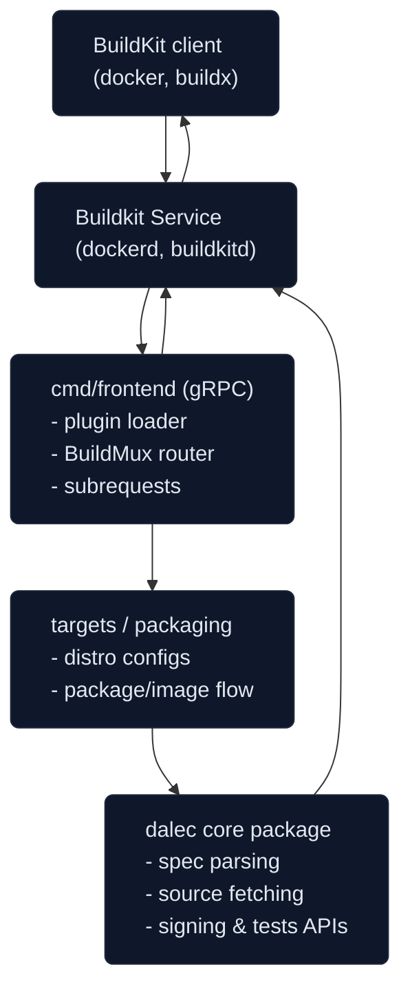

## Goals and Scope
Dalec provides a declarative workflow for building operating system packages and container images from a single spec. The repository couples a custom [BuildKit](https://github.com/moby/buildkit) frontend with distro-specific build logic, packaging templates, signing, and test automation. This document sketches the high-level architecture so maintainers and contributors understand how the moving parts fit together.


This document is a work in progress.
If you see a mistake or missing information please open an issue or ping us on [Slack](https://cloud-native.slack.com/archives/C09MHVDGMAB).


## System View

## Build Orchestration Flow
- **Entry point:** BuildKit clients invoke the Dalec frontend using the registered BuildKit syntax. Requests arrive in `cmd/frontend/main.go`, which wires up the gRPC service via `grpcclient.RunFromEnvironment`.
- **Routing:** `frontend/` initializes the `BuildMux` router. Targets register handlers that receive the request segments for their distro/platform, providing an HTTP-router-like dispatch pattern.
- **Execution:** Target handlers under `targets/` and `packaging/` construct LLB graphs that assemble distro packages, derivative container images, optional sysext bundles, and invoke signing/test helpers when configured.
- **Feedback:** The frontend streams status through BuildKit’s UI channels, persists intermediate artifacts with cache keys derived from the declarative spec, and surfaces test/signing results back to the client.

Detailed sequence:
1. **BuildKit invokes the frontend** with a build context containing a Dalec spec (the spec is the effective `Dockerfile` for the custom frontend).
2. **`BuildMux` resolves the target**: exact match, default handler, or prefix routing (e.g. `azlinux3/container`). The matched handler sees the shortened target and a `dalec.target` build option that identifies the active spec target stanza.
3. **Specs load once per build** through `LoadSpec`, which reads the spec from the Docker build context, merges build-arg substitutions (including derived platform arguments), and returns a `*dalec.Spec`.
4. **`BuildWithPlatform` fans out per platform** requested by the client, invoking a target handler for each architecture. Handler closures return an image reference and optional `dalec.DockerImageSpec` metadata.
5. **Handlers construct LLB graphs** using helpers from the `dalec` package to fetch sources, apply patches, run build steps, and generate artifacts (packages, root filesystems, signatures).
6. **Results finalize** via BuildKit: container images are pushed or exported, packages and auxiliary files are returned as BuildKit outputs, and metadata is attached for the client.

## Runtime Components
- **BuildKit frontend (`cmd/frontend/main.go`)**  
  Runs inside BuildKit, exposes a gRPC service via `grpcclient.RunFromEnvironment`, and handles build requests. Subcommands handle credential helper and test utilities reused in integration flows.

- **Frontend orchestration (`frontend/`)**  
  Implements spec loading (`build.go`), request routing (`mux.go`), BuildKit UI integration, signing hooks, and test execution. `BuildMux` acts like an HTTP router: targets register handlers which later receive trimmed build target prefixes.

- **Target plugins (`targets/`, `packaging/`)**  
  Target-specific packages (Debian, Ubuntu, RPM variants, Windows) register `gwclient.BuildFunc` handlers via a lightweight plugin framework (`internal/plugins`). Each handler knows how to build distro packages, assemble container images, and, where relevant, system extensions.

- **Tooling commands (`cmd/*`)**  
  Helper binaries provide linting, schema generation, BuildKit worker matrices, registry retagging, and log conversion for CI. These commands run outside BuildKit.

- **Shared libraries (`dalec`, `internal`, `sessionutil`, `pkg`)**  
  The root Go module exposes the spec model, source handling, cache helpers, packaging utilities, and test support. Internal packages hide pluggable subsystems (`internal/plugins`, `internal/testrunner`) from external consumers.

## Specification
- **Spec model (`spec.go`)**  
  Defines the declarative schema for packages: metadata, sources, patches, build steps, artifacts, target overrides, signing, tests, caching, image configuration, and changelog entries. YAML/JSON tags drive linting (`cmd/lint`) and schema generation (`cmd/gen-jsonschema`).

- **Sources (`source.go` & `source_*.go`)**  
  Support multiple backing stores (context tarball, Git, HTTP archives, Docker images, inline content, nested builds). `SourceOpts` bundles the BuildKit resolver, credential helpers, and context readers. Generators (Go modules, Cargo, Pip) allow producing dependency caches from source trees.

- **Artifacts (`artifacts.go`, `packaging/linux/*`)**  
  Represent build outputs such as OS packages, tarballs, and runtime sysext bundles. Targets interpret the spec’s `Artifacts`, `PackageConfig`, and `Image` sections to decide which packaging templates to apply.

- **Caches & accelerators (`cache.go`)**  
  Provide declarative cache mounts for generic directories, Go build caches, Rust `sccache`, and Bazel caches. Options propagate platform and distro context into cache keys.

- **Signing (`request.go`, `package_config.go`)**  
  `MaybeSign` stitches signing configuration pulled from spec or build context, optionally forwarding to external signing frontends. Build args such as `DALEC_SKIP_SIGNING` and `DALEC_SIGNING_CONFIG_PATH` control behavior.

## Target Implementations and Packaging
- **Plugin discovery (`cmd/frontend/plugin.go`)**  
  Auto-loads targets registered through `targets/plugin/init.go` using the containerd `plugin` graph. Only `build-target` plugins are forwarded to the mux.

- **Distro contracts (`targets/linux/distro_handler.go`)**  
  Each distro implements a `DistroConfig` interface covering validation, worker image selection, package build, package extraction, container assembly, and test execution. Common helper flows build packages once and reuse artifacts across container and sysext outputs.

- **Packaging templates (`packaging/linux/*`)**  
  Go templated assets render control files (Debian `control`, RPM spec fragments, post-install scripts) using spec data. Generated scripts run inside BuildKit worker containers to produce `.deb`, `.rpm`, or sysext tarballs.

- **Windows support (`targets/windows`)**  
  Cross-compilation support builds Windows container images and packages while running on Linux workers, handling platform-specific artifact layout.

- **Caching and reuse (`targets/cache.go`)**  
  Targets detect pre-built packages supplied via BuildKit inputs and skip rebuilds when available, reducing rebuild cost in multi-stage workflows.

## Testing and Verification
- **Declarative tests (`Spec.Tests`)**  
  Tests attach to specs or per-target overrides. Steps describe commands, expected output, mounts, and file assertions.

- **Execution engine (`frontend/test_runner.go`)**  
  Orchestrates containerized test runs using BuildKit’s LLB API, collects output in an embedded virtual filesystem (`frontend/pkg/bkfs`), and reports structured errors with source mapping.

- **Reusable helpers (`internal/testrunner`)**  
  Implements subcommands invoked by the frontend (`testrunner.StepRunnerCmdName`, `testrunner.CheckFilesCmdName`) and Go helpers used in unit tests. This keeps test logic identical between spec execution and CLI tooling.

- **Linting and schema checks (`cmd/lint`, `cmd/gen-jsonschema`)**  
  Enforce consistent YAML/JSON field usage, tag coverage, and schema drift between docs and code. CI runs these tools alongside `go test`.

## Tooling and Generated Assets
- **Generation commands**  
  - `cmd/gen-jsonschema`: emits the public JSON schema used by docs.  
  - `cmd/gen-source-variants`: maintains the `Source` union struct.  
- **Utility commands**  
  - `cmd/retagger`: retags container images (used for publishing).  
  - `cmd/test2json2gha`: converts Go test JSON to GitHub Actions annotations.  

Generated files live under `_output/` (local builds) or `docs/` (published schema & docs). Always run `go generate ./...` after touching schema-affecting files.

## Extensibility Paths
- **Add a new target**  
  Create a package under `targets/<platform>/<distro>`, implement `DistroConfig`, and register it in `targets/plugin/init.go`. Expose worker images, packaging steps, and tests tailored to the new distro.

- **Introduce a new source type or generator**  
  Extend the `Source` type with a new field with type name that starts with `Source` add the implementation under `source_<type>.go`, and regenerate `source_generated.go` (`go generate ./...).

- **Build-time integrations**  
  BuildKit subrequests handled in `frontend/mux.go` (`frontend.dalec.resolve`, `frontend.dalec.defaultPlatform`) illustrate how to add new metadata endpoints consumable via `docker buildx --print`.

## Repository Layout Reference
- `cmd/` – entrypoints for the BuildKit frontend and tooling.  
- `frontend/` – build routing, spec resolution, test runner, request helpers.  
- `targets/` – distro-specific build logic and plugin registration.  
- `packaging/` – template assets and helpers for OS package formats.  
- `dalec` root files (`*.go`) – shared spec, sources, cache, artifact logic.  
- `internal/` – plugin wiring and test runner internals not exported publicly.  
- `sessionutil/` – helpers for BuildKit client sessions.  
- `docs/`, `website/` – published documentation and static site source.  
- `test/` – integration suites exercising full BuildKit builds.

---

This document is intentionally high-level; detailed API references live alongside code in package comments and GoDoc. Use it as a map when navigating the repository or planning new features.
